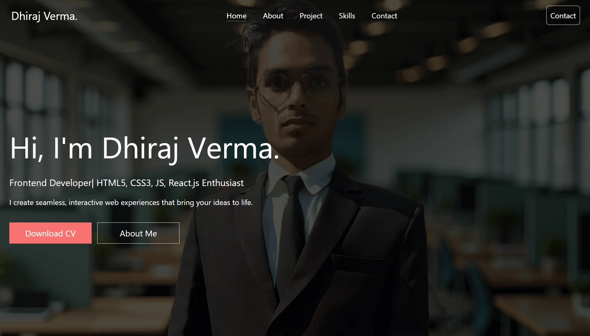

# portfolio-dhir

## 🚀 Full-Stack Developer Portfolio (MERN Stack)

**portfolio-dhir** is a modern, full-stack personal portfolio website built using the **MERN stack (MongoDB, Express, React, Node.js)**. It is designed to showcase my projects, technical skills, and professional experience in a clean, responsive, and recruiter-friendly format.

This project demonstrates real-world full-stack development practices, including RESTful APIs, component-based UI design, and scalable backend architecture.

---

## 🛠 Tech Stack

### Frontend
- React.js  
- HTML5, CSS3, JavaScript (ES6+)
- Tailwind Css
- Responsive UI design   

### Backend
- Node.js  
- Express.js  
- RESTful APIs  

### Database
- MongoDB (Mongoose ODM)

### Tools & Practices
- Git & GitHub  
- Environment variables  
- Modular code structure  
- Clean and maintainable architecture  

---

## ✨ Features

- 📌 **Project Showcase** – Display featured projects with descriptions and links  
- 🧠 **Skills Section** – Highlights technical expertise and tools  
- 📱 **Responsive Design** – Optimized for desktop, tablet, and mobile  
- ⚙️ **Full-Stack Architecture** – React frontend with Node/Express backend  
- 🗄 **Database Integration** – Dynamic data managed using MongoDB  
- 📬 **Contact Section** – Easy way for recruiters to connect  

---

## 🧩 What This Project Demonstrates

- Strong understanding of **full-stack web development**
- Ability to build and integrate **RESTful APIs**
- Experience with **React component architecture**
- Backend development with **Node.js & Express**
- Working with **MongoDB schemas and data modeling**
- Writing **clean, scalable, and maintainable code**

---

## 📂 Project Structure (High-Level)

<!-- ```text
portfolio-dhir/
│
├── client/        # React frontend
├── server/        # Node.js & Express backend
├── models/        # MongoDB schemas
├── routes/        # API routes
├── controllers/  # Business logic
└── README.md

--- -->

# Clone the repository
git clone https://github.com/your-username/portfolio-dhir.git

# Install backend dependencies
cd server
npm install

# Install frontend dependencies
cd ../client
npm install

# Run the application
npm run dev


## 📸 Screenshots

_Desktop UI Home Page Screenshot_



```md

